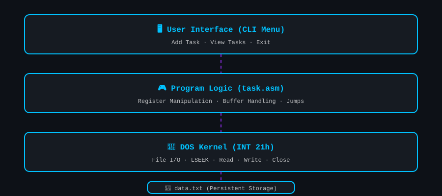
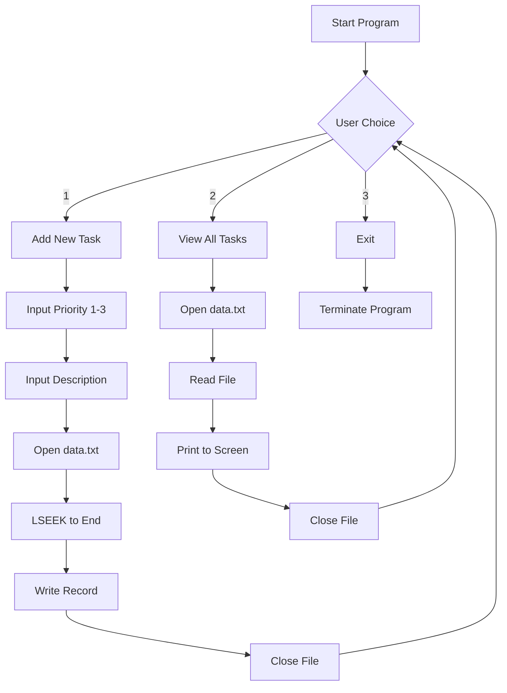
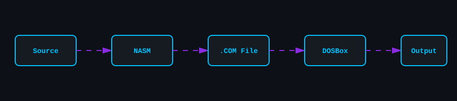
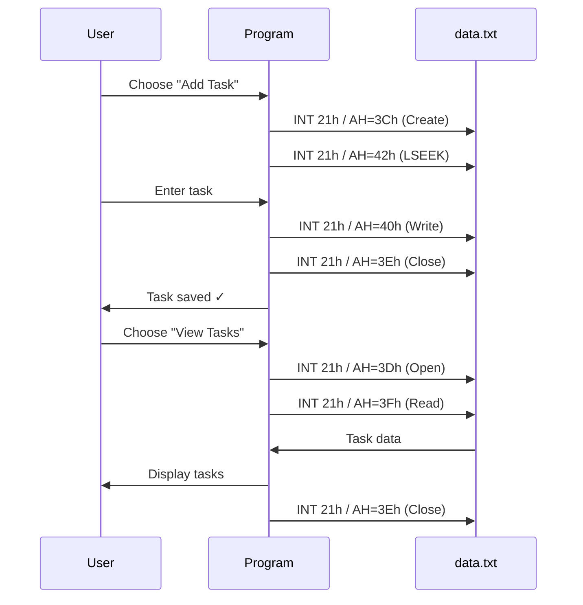

# ⚙️ x86 Assembly Task Manager

<p align="center">
  
</p>

<p align="center">
  
  
  
  
  
  
</p>

<p align="center">
  
</p>

---

## 📑 Table of Contents

- [About The Project](#-about-the-project)
- [Features](#-features)
- [Tech Stack](#️-tech-stack)
- [Project Structure](#-project-structure)
- [Architecture & Logic](#️-architecture--logic)
- [Interrupt Reference](#-interrupt-reference)
- [Getting Started](#-getting-started)
- [Usage](#-usage)
- [How It Works](#-how-it-works)
- [Key Learnings](#-key-learnings)
- [Screenshots](#️-screenshots)
- [Roadmap](#️-roadmap)
- [FAQ](#-faq)
- [Troubleshooting](#️-troubleshooting)
- [Contributing](#-contributing)
- [License](#-license)
- [Author](#-author)

---

## 📖 About The Project

**x86 Assembly Task Manager** is a low-level, CLI-based persistent task management system built with **NASM (Netwide Assembler)**. It communicates directly with the **MS-DOS kernel** using **INT 21h** interrupts — performing file I/O operations without any high-level libraries.

> 🎯 **Goal:** To demonstrate how software logic bridges directly to hardware execution through pure x86 Assembly.

This project is part of the **Computer Organization and Assembly Language** course, focusing on:
- CPU architecture
- Register manipulation
- Memory management
- Direct hardware interaction

---

## ✨ Features

| Feature | Description | Status |
|---------|-------------|--------|
| 📁 Direct File I/O | Creates and manages `data.txt` using DOS interrupts | ✅ |
| 💾 Persistent Storage | Tasks saved to disk and remain after program exit | ✅ |
| ➕ Smart Appending | Uses LSEEK logic to add new records at file end | ✅ |
| 🎯 Priority Levels | Assign priority (1–3) to organize workflow | ✅ |
| 🧩 Zero Dependencies | Written in pure x86 Assembly | ✅ |
| 🖥️ CLI Interface | Menu-driven MS-DOS interface | ✅ |

---

## 🛠️ Tech Stack

<p align="center">
  
</p>

| Technology | Purpose |
|------------|---------|
| x86 Assembly (16-bit Real Mode) | Core language |
| NASM | Assembler |
| DOSBox | Emulation environment |
| MS-DOS INT 21h | System calls |
| Git & GitHub | Version control |

---

## 📂 Project Structure

```
Computer-Organization-And-Assembly-Language/
│
├── Task Manager/
│   ├── task.asm          # Main assembly source code
│   └── task.com          # Compiled executable
│
├── assets/               # SVG animations & banners
│   ├── header.svg
│   ├── footer.svg
│   ├── typing.svg
│   ├── pipeline.svg
│   └── architecture.svg
│
├── README.md
└── LICENSE
```

---

## 🏗️ Architecture & Logic

The program follows a strictly regulated cycle to ensure **data integrity** and **memory efficiency**.

<p align="center">
  
</p>



### Execution Pipeline

<p align="center">
  
</p>

---

## 🔌 Interrupt Reference

The following **INT 21h** functions are the backbone of this project:

| AH | Operation | Purpose |
|----|-----------|---------|
| `3Ch` | Create File | Generates `data.txt` on the first run |
| `3Dh` | Open File | Accesses the file in Read/Write mode |
| `42h` | LSEEK | Moves the file pointer to the end for appending |
| `40h` | Write File | Commits task data to the disk |
| `3Fh` | Read File | Streams data from disk to terminal |
| `3Eh` | Close File | Releases the file handle safely |
| `09h` | Print String | Displays messages on screen |
| `0Ah` | Buffered Input | Reads user input from keyboard |
| `4Ch` | Terminate | Exits program and returns to DOS |

---

## 🚀 Getting Started

### Prerequisites

Before running this project, ensure you have:

- [DOSBox](https://www.dosbox.com/) installed
- `nasm.exe` available in your project folder
- A basic understanding of the DOS command line

### Installation

1. **Clone the repository**
   ```bash
   git clone https://github.com/AHMAD-0702/Computer-Organization-And-Assembly-Language.git
   ```

2. **Navigate to the Task Manager folder**
   ```bash
   cd "Computer-Organization-And-Assembly-Language/Task Manager"
   ```

### Compilation

Open **DOSBox**, mount your project directory, and run:

```bash
mount c "C:\path\to\Task Manager"
c:
nasm -f bin task.asm -o task.com
```

### Execution

Launch the program:

```bash
task.com
```

---

## 🎮 Usage

Once the program starts, you'll see a menu:

```
==============================
   TASK MANAGER - x86 ASM
==============================
1. Add New Task
2. View All Tasks
3. Exit
==============================
Enter your choice:
```

### Steps:

1. **Press `1`** — Add a new task (enter priority 1–3, then description).
2. **Press `2`** — View all tasks stored in `data.txt`.
3. **Press `3`** — Exit the application.

### Example Session

```
Enter your choice: 1
Enter priority (1-3): 2
Enter task description: Finish assembly assignment
[✓] Task saved to data.txt

Enter your choice: 2
--- Saved Tasks ---
Priority: 2 | Finish assembly assignment
```

---

## 📊 How It Works



---

## 🧠 Key Learnings

| Concept | What I Learned |
|---------|----------------|
| **Register Manipulation** | Managed data flow using `AX`, `BX`, `CX`, and `DX` |
| **Memory Displacement** | Resolved "Short Jump out of range" errors using Near Jumps |
| **Buffer Management** | Handled manual string buffering for input/output |
| **File I/O** | Direct disk operations using DOS interrupts |
| **Real Mode** | Understood 16-bit segment:offset addressing |

---

## 🖼️ Screenshots

| Main Menu | Add Task | View Tasks |
|-----------|----------|------------|
|  |  |  |

> 📌 Replace these placeholders with actual DOSBox screenshots.

---

## 🗺️ Roadmap

- [x] Basic menu system
- [x] File creation with INT 21h
- [x] Task appending with LSEEK
- [x] Task viewing
- [x] Priority levels
- [ ] Delete task feature
- [ ] Search task by keyword
- [ ] Edit existing task
- [ ] Sort by priority
- [ ] Colored terminal output

---

## ❓ FAQ

<details>
<summary><strong>Do I need real DOS to run this?</strong></summary>
No — DOSBox emulates MS-DOS perfectly. Real hardware is not required.
</details>

<details>
<summary><strong>Why 16-bit Real Mode?</strong></summary>
Because DOS interrupts (INT 21h) work in Real Mode. This is the traditional environment for learning assembly.
</details>

<details>
<summary><strong>Can I run this on Linux/macOS?</strong></summary>
Yes — install DOSBox and NASM, then follow the same steps.
</details>

<details>
<summary><strong>What is LSEEK used for?</strong></summary>
`INT 21h / AH=42h` moves the file pointer. We use it to jump to the end of `data.txt` before appending a new task.
</details>

---

## 🛠️ Troubleshooting

| Problem | Cause | Solution |
|---------|-------|----------|
| `nasm: command not found` | NASM not in PATH | Place `nasm.exe` in the project folder |
| `Short jump out of range` | Jump distance > 127 bytes | Use `jmp near` instead of `jmp short` |
| File not created | Wrong path / permissions | Ensure you're in the correct directory |
| Garbage output | Missing null terminator | Add `$` at end of strings for `INT 21h / AH=09h` |
| Program hangs | Missing `INT 21h / AH=4Ch` | Add proper exit interrupt |

---

## 🤝 Contributing

Contributions are welcome!

1. Fork the repo 🍴
2. Create a branch (`git checkout -b feature/AmazingFeature`)
3. Commit changes (`git commit -m 'Add some AmazingFeature'`)
4. Push (`git push origin feature/AmazingFeature`)
5. Open a Pull Request 🚀

---

## 📜 License

Distributed under the **MIT License**. See [`LICENSE`](LICENSE) for details.

---

## 👨‍💻 Author

**Ahmad**  
🔗 GitHub: [@AHMAD-0702](https://github.com/AHMAD-0702)

---

## 🏷️ Suggested GitHub Topics

```
assembly  x86  nasm  dosbox  low-level  file-handling  computer-organization
```

---

<p align="center">
  
</p>

<p align="center">
  <strong>⭐ If you found this project helpful, please give it a star! ⭐</strong>
</p>